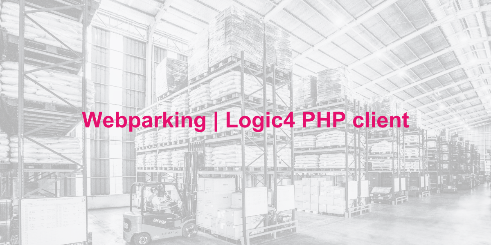

# Logic4 client
Please note that this API client is not created or maintained by Logic4. For questions about Logic4 or it's API please contact Logic4 support. 

## Installation 
You can install the package via composer:
```bash
composer require webparking/logic4-client
``` 

## Configuration
In order to use the Logic4 API, you need to configure the `AccessTokenManager` with your credentials. You can do this by calling the `configure` method on the `AccessTokenManager` instance.
 
The following configuration options are required
- `public_key` - The public key of your Logic4 account
- `company_key` - The company key of your Logic4 account
- `username` - The username of your Logic4 account
- `secret_key` - The secret key of your Logic4 account
- `password` - The password of your Logic4 account
- `administration_id` - The administration id of your Logic4 account

The access token is automatically refreshed when it expires and stored in the cache. The cache object is set using the `$cache` property on the `AccessTokenManager` class and should implement the `Psr\SimpleCache\CacheInterface` interface.

After configuring the `AccessTokenManager` you can use any request class in your application without having to worry about the access token and other middleware.

### Example configuration
```php
# In this example, we load the configuration from a .env file.
$dotEnv = Dotenv\Dotenv::createImmutable(__DIR__);
$credentials = $dotEnv->load()

# We use the ArrayStore for testing purposes, but you can use any cache implementation that implements the Psr\SimpleCache\CacheInterface interface.
$cache = new \Illuminate\Cache\Repository(new \Illuminate\Cache\ArrayStore());
    
$tokenManager = new \Webparking\Logic4Client\AccessTokenManager($cache);
$tokenManager->configure($credentials);

# Initialize the ClientFactory using the AccessTokenManager
$clientFactory = new \Webparking\Logic4Client\ClientFactory($tokenManager);

# Initialize the request class using the ClientFactory
$request = new \Webparking\Logic4Client\Requests\ProductRequest($clientFactory);
$request->getProducts([
    'DebtorId' => 1,
]);
```

## Laravel integration
Integration with Laravel is easily done by configuring the `AccessTokenManager` after it has been resolved by the Laravel IoC Container.

Add the following code to your `AppServiceProvider` class:

```php
use Webparking\Logic4Client\AccessTokenManager;

$this->app
    ->afterResolving(AccessTokenManager::class, fn (AccessTokenManager $tokenManager) => $tokenManager->configure([
        'public_key' => config('services.logic4.public_key'),
        'company_key' => config('services.logic4.company_key'),
        'username' => config('services.logic4.username'),
        'secret_key' => config('services.logic4.secret_key'),
        'password' => config('services.logic4.password'),
        'administration_id' => config('services.logic4.administration_id'),
    ]));
```

This makes it possible to directly use any request class in your application without having to worry about the access token and other middleware.

### Example request

```php
use Webparking\Logic4Client\Requests\ProductRequest;
use Webparking\Logic4Client\Data\Product;
use Illuminate\Support\Collection;

/** @return array<Product> */
public function index(ProductRequest $productRequest, int $debtorId): array
{
    $products = $productRequest->getProducts([
        'DebtorId' => $debtorId,
    ]);
    
    return iterator_to_array($products);
}
```

## Testing
You can test the package by running `./vendor/bin/phpunit` in the root of the project. Make sure install the dependencies by running `composer install` before running the tests.

```bash
composer install
./vendor/bin/phpunit
```

### Preventing stray requests
If you would like to ensure that all requests sent via the client have been mocked throughout your individual test or complete test suite, you can call the `preventStrayRequests` method on the `\Webparking\Logic4Client\ClientFactory` class. After calling this method, any requests that do not have a corresponding mock will throw an exception rather than making the actual request:

```php
// turns on stray request prevention
\Webparking\Logic4Client\ClientFactory::preventStrayRequests();

// an exception is thrown if the request is not mocked
$request->getProducts(['DebtorId' => 1]);

// turns off stray request prevention
\Webparking\Logic4Client\ClientFactory::preventStrayRequests(false);

// no exception is thrown and will make the actual request
$request->getProducts(['DebtorId' => 1]);
```

## Contributing
Please report any issue you find in the issues page. Pull requests are more than welcome.

### Generating endpoints

The endpoints can automatically be generated using the `generate` command. This command will generate a request class for each endpoint and a client class that can be used to instantiate the request classes.

```bash
make generate
``` 

## License
The MIT License (MIT). Please see [License File](LICENSE.md) for more information.

